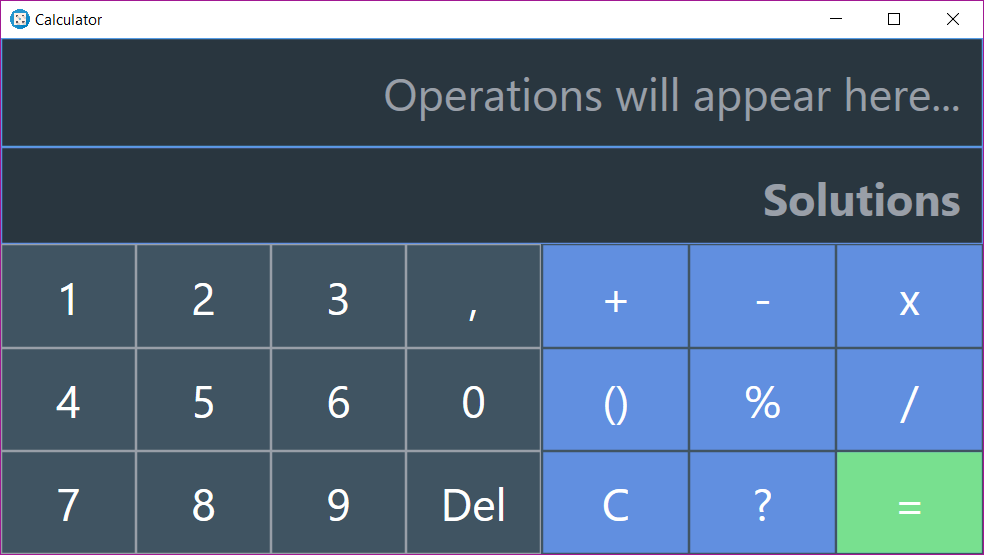
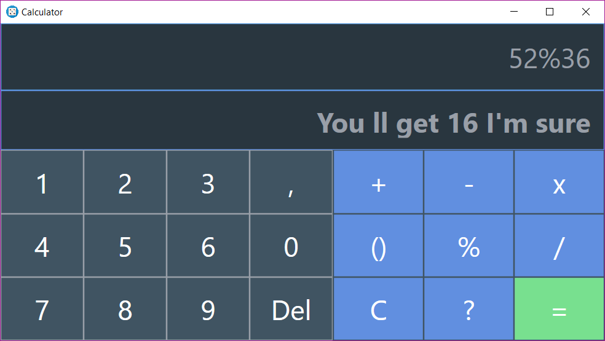
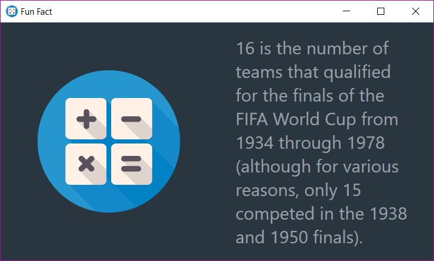

# SimpleCalculator-WPF

This calculator is my first attemtp at WPF, it can perform simple mathematical operations such as addition, multiplication...etc. In order to add a little "something" to it, the calculator offers a small fun fact about the calculated result (only if it's an integer).

## Screenshots:

## Tools used:
* Visual studio (IDE)
* C# (logic)
* XAML (design)
* Paint.Net (Image editting)

## Numbers fun facts provider (API): 
[Numbers API](http://numbersapi.com/)

## Usage:
``
Run publish/setup.exe
``

## TODO:

- [x] Make the API call asynchronous.
- [ ] Adding regex to inputs to solve syntaxe issues.
- [ ] Adding more complex functions (exponentiel, natural logarithm, power..etc).

## Contributing

Feel free to `fork` this project and add whatever you like (Helping with the TODOs would be amazing tho). If you have any suggestions or any comments please feel free to contact me or to open an issue.

## Team:
`Jetlighters` having fun.

* Special thanks to [Amine Smahi](https://github.com/Amine-Smahi) for his help with annoying questions i've had about WPF.
